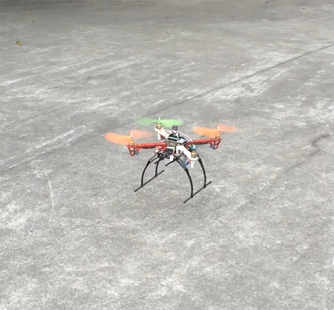

# Phoenix
 

Phoenix is a **quadcopter** based on **STM32F4** flight control board. It mainly includes four modules: 9-axis sensor module, Bluetooth module, remote controller/receiver module and electronic speed controller (ESC) control module. The sensor communicate with flight control board  by IIC protocol, and realize attitude calculation and PID control.  The Bluetooth communication with flight control board using USART protocol, and complete the debugging task. The remote controller sends PWM signals to the receiver, and the flight control board use these signals to control ESC which can let motors rotate. In order to make our quadcopter system more manageable and controllable, we port μC/OS II for task operation and management.

	
    

## 1. Hardware Requirement

|         Components          |               Models and Parameters                |
| :-------------------------: | :------------------------------------------------: |
|       Quadcopter Rack       |          F450 (Propeller pitch is 450mm)           |
| Electronic Speed Controller |              Hobbywing Skywalker-20A               |
|            Motor            |                 XXD 2212 (1000KV)                  |
|          Propeller          |  1045 (Diameter is 10 inches; Blade angle is 45°)  |
|           Battery           |      ACE 2200mAh 25C lithium-polymer battery       |
|     Main Control Board      |             STM32F401RE (Up to 84MHZ)              |
|  Accelerometer & Gyroscope  |           MPU6050 (Integrated in GY-86)            |
|        Magnetometer         |           HMC5883L (Integrated in GY-86)           |
|      Remote Controller      | RadioLink T4EU 2.4G four-channel remote controller |
|       Remote Receiver       | RadioLink R7EH 2.4G seven-channel remote receptor  |
|          Bluetooth          |           HM-10 (slave), HM-15 (master)            |
|       Expansion Board       |         Design and draw using Protel 99 SE         |

## 2. Software Requirement

Operation System: **Windows** or **Linux**

Recommend IDE: **Keil uVision** or **STM32CubeIDE**

Compiler: **ARM Compiler (using Keil uVision)** or **GNU ARM Embedded Toolchain (using makefile)**

Option: **OpenOCD** (if you want to burn program without IDE)

## 3. Build

Simply run `make` or use **Keil uVision 5** to compile.

## 4. Burn

You should install **ST-LINK/V2 driver** first. Then plug the **flight board (STM32)** into your computer, and simply run `make burn` or use **Keil uVision 5** to burn.